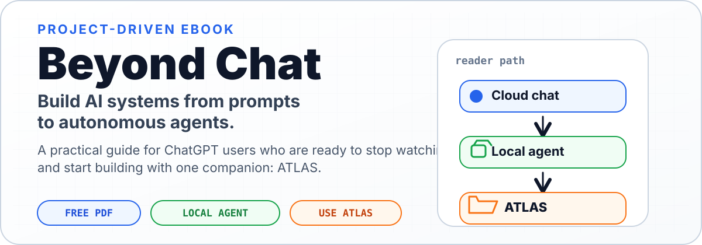

# Beyond Chat

<p align="center">
  
</p>

**Working subtitle:** A practical guide to building AI systems from prompts to
autonomous agents.

**Beyond Chat** is an in-progress, project-driven ebook for people who know how
to use ChatGPT, have watched advanced AI content, and now need a guided path
from passive understanding to real building.

The reader builds with **ATLAS**, the book-aware agent companion. ATLAS helps
the reader move from cloud chat into a local agent workflow, then helps build a
shared AI second-brain knowledgebase for one person scaling toward a small team
of around 10 people.

> **Doing is learning, not reading.**
>
> A reader can upload the PDF to cloud ChatGPT and read along, but the
> recommended path moves them into a local/free agent workflow so ATLAS can help
> them build chapter by chapter.

## Current Status

The project is still in the **Bookwright bootstrap** phase.

Do **not** start drafting chapters yet. `manifesto.md` has been generated,
self-reviewed, and is pending author confirmation. The next editorial gate is
to confirm or correct `manifesto.md`, run the voice interview, and create
`voice.md`. Only after those are confirmed should the formal TOC, research
corpus, evidence-rich outline, and chapters be locked.

Settled direction:

| Area | Decision |
|---|---|
| Format | Free PDF |
| Distribution | Dedicated website page with PDF, setup instructions, links, and resources |
| Target size | 80-120 pages as a provisional first-edition target |
| Reader level | Basic ChatGPT use only |
| Research posture | Research-backed technical guide with curated sources |
| Teaching split | Roughly 70% content/visual explanation, 30% project work |
| Agent persona | ATLAS, the book-aware companion agent |
| Project | Local agent companion first, then shared memory system |
| Build target | A working local shared memory system |
| Default action path | Move from cloud chat into a local/free agent workflow |
| Free model path | DeepSeek Harness Desktop + OpenRouter free models, with caveats |
| Alternatives | Pi and Hermes for CLI use; Codex app for ChatGPT users |
| Code artifact candidate | eve, GitHub, Vercel free-tier path where suitable |

Current facts about tools, providers, free models, rate limits, and product
features must be re-verified before publication.

## Project Proof

This repository already contains the decisions and source material needed to
recover the book without chat history:

- The source-of-truth handoff: [`PROJECT-STATE.md`](PROJECT-STATE.md)
- The generated manifesto draft: [`manifesto.md`](manifesto.md)
- The editorial method: [`EDITORIAL-WORKFLOW.md`](EDITORIAL-WORKFLOW.md)
- The broad curriculum map: [`BOOK-BLUEPRINT.md`](BOOK-BLUEPRINT.md)
- The approved checkpoint path: [`roadmap.md`](roadmap.md)
- The ATLAS reference analysis:
  [`reference-projects/shared-living-memory-analysis.md`](reference-projects/shared-living-memory-analysis.md)
- The ATLAS agent persona: [`soul.md`](soul.md)
- The approved visual direction:
  [`visual-references/generated-samples/`](visual-references/generated-samples/)
- The interactive project map:
  [`docs/diagrams/beyond-chat-project-map.html`](docs/diagrams/beyond-chat-project-map.html)

## Start Here

Read these files in order when recovering the project:

1. [`PROJECT-STATE.md`](PROJECT-STATE.md) - durable handoff, settled decisions,
   open questions, audit findings, and next sequence.
2. [`soul.md`](soul.md) - ATLAS, the book-aware companion agent persona.
3. [`manifesto.md`](manifesto.md) - generated and self-reviewed manifesto draft
   pending author confirmation.
4. [`roadmap.md`](roadmap.md) - approved ATLAS/shared-memory checkpoint path.
5. [`CORE-PRINCIPLES.md`](CORE-PRINCIPLES.md) - the 10 principles through which
   the entire book should be read.
6. [`CONCEPTUAL-FRAMEWORKS.md`](CONCEPTUAL-FRAMEWORKS.md) - capability ladder,
   seven planes, AI-system iceberg, autonomy ladder, and recurring models.
7. [`BOOK-BLUEPRINT.md`](BOOK-BLUEPRINT.md) - broad pre-manifesto curriculum
   architecture, not the final TOC.
8. [`EDITORIAL-WORKFLOW.md`](EDITORIAL-WORKFLOW.md) - research, outline, build,
   writing, evaluation, and editing workflow.
9. [`research/SOURCE-STANDARDS.md`](research/SOURCE-STANDARDS.md) - evidence and
   resource requirements.
10. [`NEXT-SESSION-PROMPT.md`](NEXT-SESSION-PROMPT.md) - copy/paste handoff for a
   fresh AI session.

## What The Book Teaches

The book teaches durable AI-system primitives, not a temporary stack of vendor
features.

```text
Model
  ↓
Prompt
  ↓
Context
  ↓
Tools
  ↓
Agent
  ↓
Harness
  ↓
Workflow
  ↓
Evaluation
  ↓
Autonomy
  ↓
Multi-Agent System
  ↓
Self-Improving AI System
  ↓
AI-Native Organization
```

Products such as agent CLIs, model providers, MCP implementations, coding
agents, and workflow engines are examples. The curriculum is the underlying
system: context, memory, tools, runtime, trust, operations, humans, and business
value.

## ATLAS And The Project

**ATLAS** is the agent persona that represents the book when the PDF is uploaded
into ChatGPT, a local agent, or another AI assistant. Its durable persona lives
in [`soul.md`](soul.md).

The shared memory system that ATLAS helps the reader build is inspired by
[`shared-living-memory`](https://github.com/Ntrakiyski/shared-living-memory).

The book now has two connected build layers:

| Layer | Purpose |
|---|---|
| Project 1: ATLAS companion | Install an existing agent environment, give it the ATLAS persona, learn its capabilities, and expand it with instructions, folders, skills, MCP, tools, permissions, and operating rules |
| Project 2: shared memory system | Use ATLAS to build the solo-to-team AI second-brain knowledgebase |

This avoids forcing readers to build an agent loop from zero before they
understand what agents are for. They first learn by using and extending a real
agent, then use ATLAS to build the memory system.

The approved 12-checkpoint path lives in [`roadmap.md`](roadmap.md). It is a
manifesto input, not the final TOC.

The teaching implementation does not need to copy that repository, but a reader
who builds along should reach the same kind of product, or roughly 80% of its
core capability:

- personal and shared knowledge capture
- source-grounded answers
- context selection instead of one giant prompt
- memory that can serve one person and a small team
- provenance, permissions, review, and governance
- agents that can work with the knowledgebase under constraints

When code artifacts are needed, **eve** is the current candidate because its
filesystem-first agent structure keeps instructions, tools, skills, subagents,
channels, and schedules visible as folders and files. GitHub is the source-code
home, Vercel is the first deployment path where the free tier is sufficient for
learning, and Docker is used only when it removes friction or isolates a real
dependency.

## Before Chapter 1

The book needs a short opening section before the first technical chapter.

| Section | What It Contains |
|---|---|
| Opening quote | One strong quote that frames the move from passive AI use to active system building |
| Transformation overview | One spacious page explaining how the reader will change and what they will become after the book |
| Promise | What the reader will be able to understand and build by the end |
| Reader contract | Basic ChatGPT knowledge is enough, but doing is required |
| Cloud fallback | Upload the PDF to cloud ChatGPT if needed, but treat that as reading mode |
| Local agent setup | Move to a local/free agent environment on the reader's computer |
| Free tooling path | DeepSeek Harness Desktop with OpenRouter free models; Pi/Hermes/Codex app as alternatives |
| Agent system prompt | A short copy/paste instruction that turns the uploaded-book assistant into ATLAS |
| ATLAS mission | Help the reader understand the book and build a second brain for one person that can grow to a small team |
| How chapters work | Problem, build, break, inspect, evaluate, system upgrade, what's next |
| Core principles | The 10 durable principles that guide every later chapter |
| System map | The full journey from model to AI-native organization |
| Safety note | Local files, API keys, permissions, free-model limits, and non-production caveats |

## Chapter 1 Candidate

Working title: **The New Computing Model**

Chapter 1 should make the reader feel the difference between chatting with AI
and building with AI.

| Topic | What It Contains |
|---|---|
| The problem | Cloud chat is useful, but it is disconnected from files, tools, project state, and repeatable systems |
| What we are building | The first local agent workspace, the ATLAS persona, and the first project interaction |
| Cloud chat vs local agent | What changes when an agent can see files, run tools, and work inside a project folder |
| Model vs assistant vs agent vs workflow | Simple definitions based on what each system can actually do |
| The model call | Prompt, context, model, response, output shape, and why this is the smallest unit of the system |
| Probabilistic software | Why AI output varies, why confidence can be misleading, and why inspection/evals matter |
| The AI-system iceberg | The visible chat is only the surface; underneath are data, runtime, state, trust, operations, humans, and value |
| First system baseline | Create the project folder, add the first note/source, ask ATLAS to produce a grounded summary or project brief |
| Break it | Give ATLAS a vague request or missing source and show how it guesses, drifts, or overclaims |
| Under the hood | Inspect prompt, context, files used, tool access, model choice, tokens/cost where available |
| Evaluate | Compare cloud-only reading mode vs local-agent building mode on concrete criteria |
| System upgrade | ATLAS now has a workspace, a first knowledge artifact, and a baseline way to help |
| What is next | The limitation is context: ATLAS still does not know how to choose the right information reliably |

## Chapter Contract

Every technical chapter should follow this pattern unless there is a strong
editorial reason to deviate:

1. The Problem
2. What We Are Building
3. Mental Model
4. Build
5. Break It
6. Under the Hood
7. Production Lens
8. Evaluate
9. System Upgrade
10. Evidence & Resources

The project is not end-of-chapter homework. The project is the teaching
mechanism.

## Reference Material

Creator and technical references live under
[`creator-profiles/`](creator-profiles/).

| Source | Role |
|---|---|
| Dan Koe | Teacher: momentum, reader energy, identity-level framing |
| Matt Pocock | Teacher: disciplined AI build workflow |
| Nate Herk | Content/reference: AI-curious audience, automation, second-brain framing |
| AI Engineer | Content/reference: production examples and research leads |
| Stanford CS329A | Content/reference: rigor around self-improving agents and evals |

Visual direction lives under [`visual-references/`](visual-references/). The
approved generated samples use a white-page, spacious, hand-drawn explainer
style with short labels and colored outline accents.

README assets live under [`assets/readme/`](assets/readme/).

## Bookwright

The editorial workflow is based on Adrian Mastronardi's
[Bookwright](https://github.com/AdrianMastronardi/bookwright) long-form writing
system.

Local Bookwright material:

- [`skills/bookwright/SKILL.md`](skills/bookwright/SKILL.md)
- [`skills/bookwright/bootstrap.md`](skills/bookwright/bootstrap.md)
- [`skills/bookwright/workflow.md`](skills/bookwright/workflow.md)
- [`skills/bookwright/LICENSE`](skills/bookwright/LICENSE)

The upstream Bookwright templates have been vendored under
[`skills/bookwright/templates/`](skills/bookwright/templates/) with the local
MIT license preserved in [`skills/bookwright/LICENSE`](skills/bookwright/LICENSE).

## Next Editorial Steps

1. Confirm or correct `manifesto.md`.
2. Run the voice interview.
3. Create `voice.md` and get author confirmation.
4. Lock the first-edition scope and convert the approved checkpoint path into a
   formal TOC.
5. Convert `BOOK-BLUEPRINT.md` into `toc.md`.
6. Build the initial research corpus and `references.bib`.
7. Create `outline.md` chapter cards.
8. Mark Chapter 1 `DRAFT-READY`.
9. Only then draft Chapter 1.
